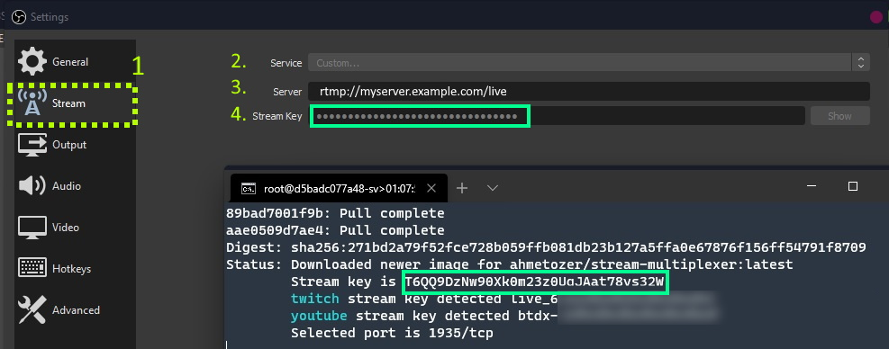

# Stream Multiplexer

Do you want to broadcast to more than one platform easily or the capacity of your internet connection does not allow broadcasting to more than one platform at the same time?
This repo is your assistant to solve this kind of problems.

This system requires a docker. If you don't, please install docker on your computer or server. You can find many tutorials about that, or you can follow [docker.com](https://www.docker.com/products/docker-desktop) guidelines.

## Container Configuration

### Setting Stream Key Per Platform

By setting platform stream key, the stream platform configurations in system will be active and use your stream keys.

For example if I want to stream youtube and twitch, i will set youtube and twitch enviroment to stream keys.

```bash
docker run -it --rm -e twitch=myTwitchKey -e youtube=myYoutubeKey -p 1935:1935 ghcr.io/ahmetozer/stream-multiplexer
```

### Multiplexer Stream Key

Stream key is automatically generated by system. But this key is change on every run. If you want to static key
you can set `stream_key` enviroment variable.

```bash
docker run -it --rm -e twitch=myTwitchKey -e youtube=myYoutubeKey -e stream_key=165184asdf8a4sgWwt -p 1935:1935 ghcr.io/ahmetozer/stream-multiplexer
```

### IP Restriction

For more secure, you can restrict streamer IP address with setting client_addr variable

```bash
docker run -it --rm -e twitch=myTwitchKey -e youtube=myYoutubeKey -e client_addr=198.51.100.5  -p 1935:1935 ghcr.io/ahmetozer/stream-multiplexer
```

## OBS Configuration

After deploying server, you have to change settings in OBS.

1. Open settings in OBS and select Stream section.

1. Select service to custom.

1. Enter your server address. If you run container at remote, the scheme will be `rtmp://your.domain/live` or `rtmp://198.51.100.1/live`.  
If you run at local, you can use `rtmp://localhost/live` as server address in OBS.

1. Stream key is given by Multiplexer Stream Server. If you define custom key on server, please enter same key to obs.

